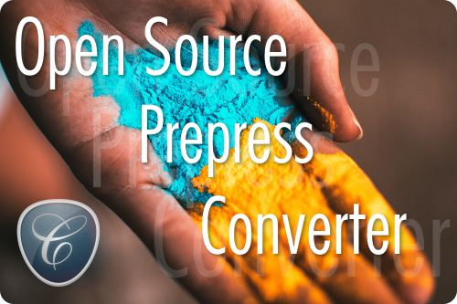

# Cyan

Cyan is an open source cross-platform image viewer and converter, designed for [prepress](https://en.wikipedia.org/wiki/Prepress) (print) work. Like converting an image from [RGB](https://en.wikipedia.org/wiki/RGB_color_model) to [CMYK](https://en.wikipedia.org/wiki/CMYK_color_model), or the other way around. Cyan supports [color profiles](https://en.wikipedia.org/wiki/ICC_profile) complying with the [International Color Consortium](http://www.color.org/index.xalter) (ICC) standard, and strives to create as color-accurate images as possible, with support for [RGB](https://en.wikipedia.org/wiki/RGB_color_model), [CMYK](https://en.wikipedia.org/wiki/CMYK_color_model) and [GRAY](https://en.wikipedia.org/wiki/Grayscale).

# Features

* Supports RGB/CMYK/GRAY images
* Supports ICC/ICM v2/v4 color profiles
* Supports PNG, JPEG, TIFF, XCF and PSD image input
* Supports TIFF, JPEG and PSD image output
* Supports TIFF, XCF and PSD image layers
* Extract embedded ICC color profiles from images
* Add ICC color profile to image
* Edit ICC color profile tags
* Convert to and from RGB/CMYK/GRAY
* Change image bit depth
* GIMP integration (import/export)

# News

News and updates related to Cyan.

 * [Cyan 1.2.3 released](https://github.com/rodlie/cyan/releases/tag/1.2.3)
 * [Cyan 1.2.2 released](https://github.com/rodlie/cyan/releases/tag/1.2.2)
 * [Cyan 1.2.1 released](https://github.com/rodlie/cyan/releases/tag/1.2.1)
 * [Cyan 1.2.0 released](https://github.com/rodlie/cyan/releases/tag/1.2.0)

# Open Source

This software is governed by the CeCILL license under French law and abiding by the rules of distribution of free software. You can use, modify and / or redistribute the software under the terms of the CeCILL license as circulated by CEA, CNRS and INRIA at the following URL https://www.cecill.info.
