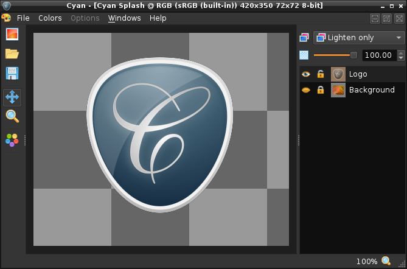

# Cyan

Cyan is an simple image editor for Windows and Linux based on [ImageMagick](https://imagemagick.org).

**This is experimental software, not for regular use**.

## Features

...

## Download

* Windows 7/8/10 x64
* Ubuntu 20.04 x86_64
* Source code

## Requirements

Minimum:

* Dual Core x86_64 CPU
* 4GB RAM

Recommended:

* Quad Core x86_64 CPU
* 8GB+ RAM

*General rule of thumb: The more cores the faster things go, the more memory you have the more layers and images can be used at the same time.*

## Open Source

The following software are required to build Cyan from source:
* GCC *>= 5 (Linux)*
* MSVC *>= 14 (Windows)*
* CMake *>= 3.0*
* Qt *>= 5.5 (5.12 recommended)*
  * *Core, Gui, Widgets, Concurrent, Test*
* ImageMagick (Magick++) *>= 7.0.10*
* Little CMS *>=2.0*
* pkg-config/pkgconf *(Linux)*

## Shortcuts

Currently the supported shortcuts in Cyan are:

| Shortcut           | Action                             |
| ------------------ | ---------------------------------- |
| Ctrl + N           | New                                |
| Ctrl + O           | Open                               |
| Ctrl + Q           | Quit                               |
| Ctrl + F4/W        | Close                              |
| Ctrl + 1           | Zoom 100%                          |
| Ctrl + 2           | Zoom to fit                        |
| Ctrl + Tab         | Switch image                       |
| Ctrl + G           | Add vertical guide                 |
| Ctrl + Shift + G   | Add horizontal guide               |
| Ctrl + Z           | Undo                               |
| Ctrl + Shift + Z   | Redo                               |
| Arrows (+Shift)    | Move selected layer X/Y            |
| PageUp             | Move selected layer stack up       |
| PageDown           | Move selected layer stack down     |
| Mouse wheel        | Zoom                               |
| Third mouse        | Switch interactive tool            |
| Left mouse         | Drag (if move tool selected)       |
| Left mouse + Wheel | Brush size (if draw tool selected) |

## License

Copyright (c) Ole-André Rodlie. All rights reserved.

This program is free software; you can redistribute it and/or modify it under the terms of the GNU General Public License as published by the Free Software Foundation; either version 2.0 of the License, or (at your option) any later version.

This library is free software; you can redistribute it and/or modify it under the terms of the GNU Lesser General Public License as published by the Free Software Foundation; either version 2.1 of the License, or (at your option) any later version.

The copyright holders of Cyan hereby grant permission for non-GPL compatible plug-ins and add-ons to be used and distributed together with Cyan, provided that you also meet the terms and conditions of the licenses of those plug-ins and add-ons.

This program and library is distributed in the hope that it will be useful, but WITHOUT ANY WARRANTY; without even the implied warranty of MERCHANTABILITY or FITNESS FOR A PARTICULAR PURPOSE.

* Cyan includes icons from [FatCow](https://www.fatcow.com) Hosting that are licensed under [CC Attribution 3.0 US](http://creativecommons.org/licenses/by/3.0/us/)
* Cyan logo is licensed under [CC Attribution-ShareAlike 4.0 International](http://creativecommons.org/licenses/by-sa/4.0/)
* Cyan include some components from Nokia Qt Solutions licensed under the GNU Lesser General Public License 2.1+

**sRGB_IEC61966-2-1_no_black_scaling.icc**

To anyone who acknowledges that the file "sRGB_IEC61966-2-1_no_black_scaling.icc" is provided "AS IS" WITH NO EXPRESS OR IMPLIED WARRANTY, permission to use, copy and distribute these file for any purpose is hereby granted without fee, provided that the file is not changed including the ICC copyright notice tag, and that the name of ICC shall not be used in advertising or publicity pertaining to distribution of the software without specific, written prior permission. ICC makes no representations about the suitability of this software for any purpose.

**ISOcoated_v2_300_bas.icc / ISOcoated_v2_grey1c_bas.icc**

Copyright (c) 2007-2010, basICColor GmbH

This software is provided 'as-is', without any express or implied
warranty. In no event will the authors be held liable for any damages
arising from the use of this software.

Permission is granted to anyone to use this software for any purpose,
including commercial applications, and to alter it and redistribute it
freely, subject to the following restrictions:

  1. The origin of this software must not be misrepresented; you must  
not
  claim that you wrote the original software. If you use this software
  in a product, an acknowledgment in the product documentation would be
  appreciated but is not required.

  2. Altered source versions must be plainly marked as such, and must  
not be
  misrepresented as being the original software.

  3. This notice may not be removed or altered from any source
  distribution.

## Changelog

Changes, history and roadmap for Cyan.

## 2021 Q2

**Release date : TBA *(end of Q2)***

Planned features:

  * [ ] Batch image converter (plug-in/standalone)
  * [ ] Effects initial support
  * [ ] Add missing features from v1

## 2021 Q1

**Release date : TBA *(end of Q1)***

Mostly fixes/re-structure with some new features. Still a development release.

  * New version scheme based on year, fiscal quarter and optional patch
  * Split into application(s) (GPL2) and library (LGPL2)
  * Several bug and UI fixes
  * Initial undo/redo support (very limited)
  * ImageMagick 7.0.10 is now the minimum supported version
  * Set ImageMagick memory limit to 75% of total RAM
  * Several Windows fixes (MinGW is not supported anymore)
  * macOS support dropped due to issues with ImageMagick 7.x
  * Disabled brush feature (until core is done, was just a test anyway)
  * Change layer stacking with PageUp/PageDown keys
  * Disabled fontconfig (not needed yet)
  * Dropped FFmpeg support (avoid feature creep)

## 1.99.3

**Release date : 20191103**

Feature and bugfix release.

  * Added support for system theme/style
  * Ui changes
  * Improved new image/layer dialog
  * Option to add background on new image or layer
    * Solid
    * Gradient
    * Radial
    * Plasma
    * Noise
  * Initial support for GIMP project format (XCF) *(read-only)*
    * This also includes multi-layered PSD and TIFF files
  * One unified load button/function
  * One unified save button/function
  * Proper save function
  * Fix tabs styles bug
  * Fixed various bugs
  * Fix potential crash if no color profiles present
  * macOS support (Lion 10.7+)
## 1.99.2

**Release date : 20190929**

Bugfix release.

* UI clean up
* Bug fixes

## 1.99.1

**Release date : 20190919**

First step on the road to version 2.0. This (1.99.x) is a development release, not for end-users.

* Initial support for video frame import
* Initial support for guides
* Initial support for (widget) plugins
* Initial support for zoom
* Confirm close/quit if we have unsaved image(s)
* Complete re-write from ground up, now an image editor (well, it's a start)
* Includes a bunch of bugs and missing features, enjoy :)

## 1.2.2

**Release date : 20191103**

 * Added support for output compression quality
 * Added support for ImageMagick 7
 * Support for system theme
 * Fixed GIMP support on Linux

## 1.2.1

**Release date : 20181204**

 * Fixed GIMP 2.10 Windows support
 * Fixed broken Cyan Python plug-in
 * Support XCF (GIMP image format)
 * Support reading layers from XCF, TIFF, PSD

## 1.2.0

**Release date : 20181203**

 * Major "behind-the-scene" changes
 * Improved performance
 * Save to JPEG
 * Enhanced image information
 * Third-party software updates
 * Fixed issues converting HDR images

## 1.0.0

**Release date : 20160814**

 * first public release
