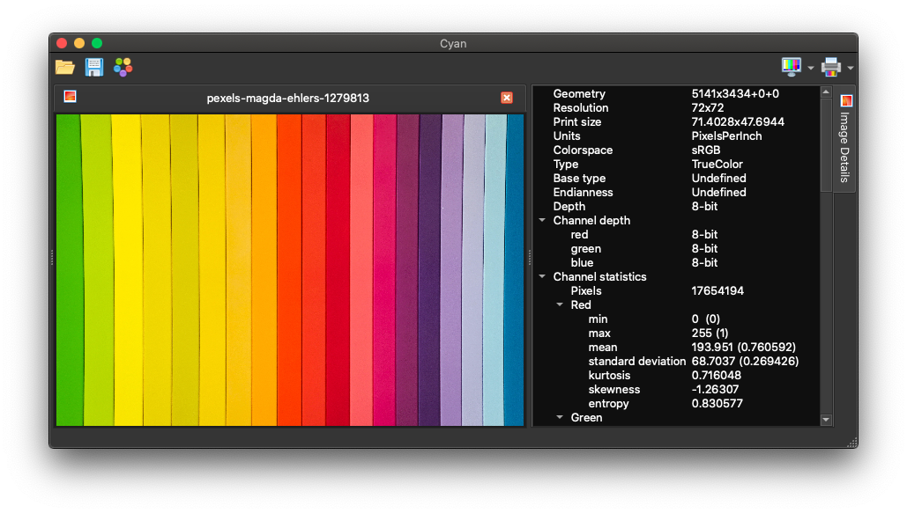

# Cyan Graphics

[Prepress](https://en.wikipedia.org/wiki/Prepress) image processing application.




**This is a complete rewrite of Cyan, ETA Q1 2023.**

## Requirements

System requirements for official binary releases.

* x86_64 SSE 4.1 compatible CPU
* 4GB+ RAM
* Windows 7+
* OS X 10.10+
* macOS 10.13+
* GNU/Linux X11 libgcc 4.8.5+/glibc 2.17+

## Color profiles

[ICC color profiles](https://en.wikipedia.org/wiki/ICC_profile) are essential for using Cyan. It's recommended that you install a basic set of color profiles before using Cyan.

### Search paths

* ``HOME``/.icc
* ``HOME``/.color/icc
* ``HOME``/Library/ColorSync/Profiles
*  /Library/ColorSync/Profiles
* /WINDOWS/System32/spool/drivers/color

*Other paths may also be searched depending on your OS.*

### Resources:

* [Adobe profiles](https://www.adobe.com/support/downloads/iccprofiles/icc_eula_win_end.html)
* [European Color Initiative (ECI) profiles](http://www.eci.org/doku.php?id=en:downloads)
* [ICC Profile Registry](https://www.color.org/registry/index.xalter)
* [ISO/Fogra profiles](https://www.colormanagement.org/en/isoprofile2009.html)
* [GRACoL profiles](https://www.colormanagement.org/en/gracolprofile.html)
* [SWOP Profiles](https://www.colormanagement.org/en/swopprofile.html)
* [OpenICC profiles](https://sourceforge.net/projects/openicc/files/OpenICC-Profiles/)

## Roadmap

### v3.0.0

* ``[ 90% ]`` **New backend**
* ``[ 75% ]`` **New frontend**
* ``[ --- ]`` **Queue**

## Source

### Requirements

 * C++11 (GCC/Clang/MSVC)
 * CMake *(3.9+)*
 * Qt *(5.9+/6.x)*
   * Core/Concurrent/Gui/Widgets/Test
 * LCMS *(2+)*
 * (Image)Magick++ *(6.9+)*
   * Q16/HDRI/OpenMP/LCMS/TIFF/JPEG/PNG

### Build (generic)

```
cd cyan
mkdir build
cd build
cmake -DCMAKE_BUILD_TYPE=Release ../v3
make
make test
```
